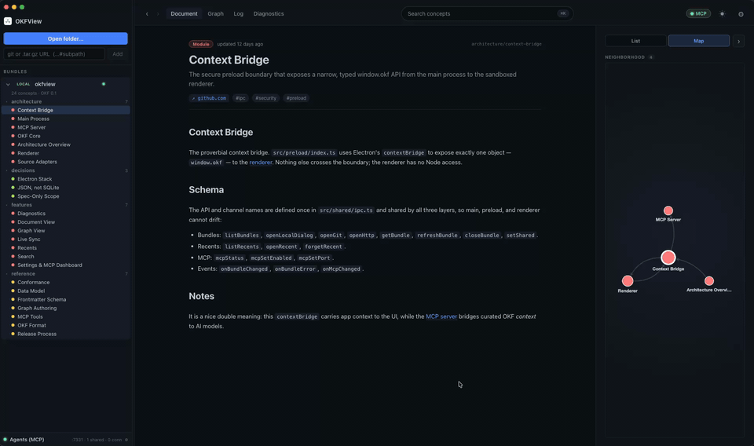
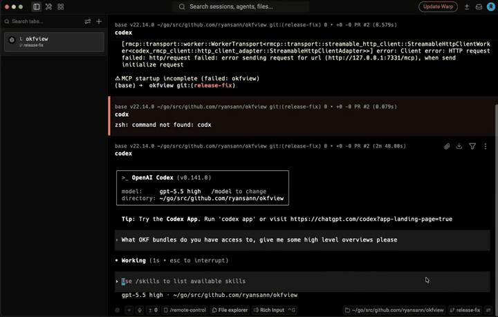

<div align="center">

# OKFView

**A configurable context bridge for your projects, docs, and coding agents, built on [Open Knowledge Format](https://github.com/GoogleCloudPlatform/knowledge-catalog/blob/main/okf/SPEC.md).**

[](https://github.com/ryansann/okfview/actions/workflows/ci.yml)
[](https://github.com/ryansann/okfview/releases)
[](LICENSE)
[](https://github.com/GoogleCloudPlatform/knowledge-catalog/blob/main/okf/SPEC.md)
[](docs/okf/reference/mcp-tools.md)


</div>

## Demos

### For humans

[](docs/assets/demos/okfview-preview.mp4)

[Watch the full in-app demo](docs/assets/demos/okfview-preview.mp4)

### For agents

[](docs/assets/demos/okfview-agent-demo.mp4)

[Watch the full agent demo](docs/assets/demos/okfview-agent-demo.mp4)

## What is OKFView?

[OKF](https://github.com/GoogleCloudPlatform/knowledge-catalog/blob/main/okf/SPEC.md) is
Google Cloud's open standard for representing knowledge as a directory of Markdown files
with YAML frontmatter.

**OKFView** turns OKF into a shared knowledge layer across all the places you work: local
projects, documentation folders, reference bundles, and coding agent sessions. Open the
knowledge once, scope what should be shared, and let humans and agents browse the same live
context over a polished desktop UI and the Model Context Protocol.

Think of it as:

```text
OKF >> skills
```

Skills are useful entry points, but OKF gives you a finer-grained web of documents:
concepts, references, backlinks, process notes, conformance checks, and relationships that
can be progressively disclosed instead of dumped into one long prompt or one giant
directory. That makes it a better home for tacit project knowledge: how systems are shaped,
why decisions were made, what workflows matter, and which references an agent should use
before touching code.

## Why it matters

- **Bridge every project** - keep reusable knowledge in OKF bundles and open them wherever you need context.
- **Share context across agent sessions** - expose selected bundles over MCP instead of re-explaining the same project history.
- **Progressively disclose knowledge** - agents can list bundles, inspect tables of contents, read one concept, follow links, and search when needed.
- **Encode tacit process** - capture decisions, workflows, review rules, domain notes, and references as linked documents, not scattered instructions.
- **Keep humans in the loop** - browse, validate, and edit the same knowledge graph your agents consume.

## Features

- **Document view** - rendered Markdown with frontmatter, schema tables, citations, outgoing links, and backlinks.
- **Graph view** - an interactive concept graph, colored by type, with click-to-navigate links.
- **Command palette** - full-text search (`Cmd+K` / `Ctrl+K`) across every open bundle, including body text.
- **Local and remote sources** - open a folder, git repo (`...repo.git#subpath`), or `.tar.gz` URL.
- **Live sync** - file edits appear instantly without losing your place; remote sources poll for updates.
- **MCP server** - expose scoped bundles to coding agents so they can browse, search, and validate OKF.
- **Diagnostics** - OKF v0.1 conformance issues are surfaced, never enforced.
- **Persistence** - open bundles auto-restore; recent bundles and aliases are remembered.

## Install (macOS)

Download the latest `.dmg` (arm64 or x64) from the
[**Releases**](https://github.com/ryansann/okfview/releases) page and drag OKFView to
Applications.

Public macOS releases are Developer ID signed and notarized. See
[Security](SECURITY.md#packaging-and-macos-signing) for packaging details.

Other platforms can [build from source](CONTRIBUTING.md).

## Quick start

1. **Open a bundle** - click **Open folder...** and pick an OKF directory (try this repo's own [`docs/okf/`](docs/okf/index.md)).
2. **Explore** - read in the document view, switch to the graph, press `Cmd+K` / `Ctrl+K` to search.
3. **Connect an agent** - in **Settings > Agents (MCP)**, enable the server and share a bundle, then:

   ```bash
   claude mcp add --transport http okfview http://127.0.0.1:7331/mcp
   ```

## Documentation

OKFView documents itself **in the format it views**: the docs are a native, conformant OKF
bundle at [**`docs/okf/`**](docs/okf/index.md); open it in the app to browse the
architecture, features, reference, and design decisions as a graph.

- [Architecture](docs/okf/architecture/index.md)
- [Features](docs/okf/features/index.md)
- [Reference](docs/okf/reference/index.md)
- [Decisions](docs/okf/decisions/index.md)
- [MCP tools reference](docs/okf/reference/mcp-tools.md)
- [DESIGN.md](DESIGN.md)

## Contributing

OKFView is open source and contributions are welcome; see
[CONTRIBUTING.md](CONTRIBUTING.md) for dev setup, the repo layout, and the PR flow. Please
also review the [Code of Conduct](CODE_OF_CONDUCT.md), [Security Policy](SECURITY.md), and
[Support guide](SUPPORT.md).

## License

[Apache-2.0](LICENSE), matching the OKF ecosystem.
